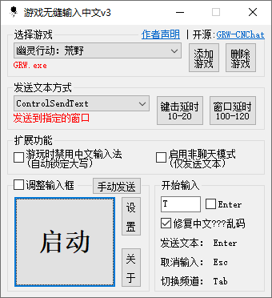
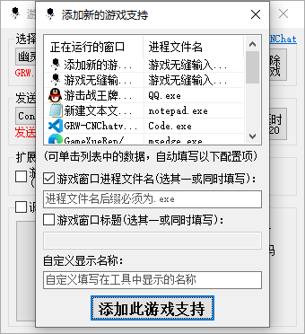
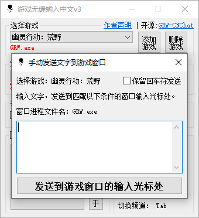
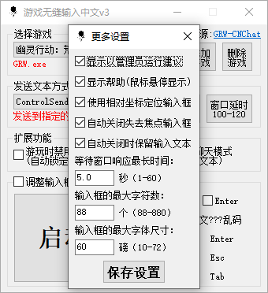

# GRW-CNChat
## 游戏无缝输入中文-通用性工具，采用AutoHotkey v2脚本语言编写。 
**游戏内无感对接，不用额外操作。正常按键开始聊天，回车发送，Esc取消，无缝输入中文。**  
[下载工具最新版本](https://github.com/GameXueRen/GRW-CNChat/releases/latest)
## 声明：  
* **此工具不涉及游戏文件及内存数据篡改，仅模拟按键操作和使用win系统API实现全流程自动化。**
* **对于支持游戏内输入中文可能的后果，完全取决于游戏厂商的判定，请自行取舍。此工具及作者不承担任何责任。**  
## 界面：

## 特色：
**1. 启用后，无缝对接，游戏内无需额外操作，即可输入中文。**  
**2. 支持自定义添加其他游戏适配。**  
**3. 提供参数调试选项(6种发送方式、延时调校)，以适配更多游戏。**  
**4. 自动保存各个游戏的工具配置及输入框调整后的位置大小。**  
**5. 游玩时自动锁定大写等扩展功能。**  
## 常见问题：
**1. 发送中文后，游戏内显示乱码问号？**  
在启动游戏前，先切换到中文输入法，再启动游戏。  
或者进入win系统设置->时间和语言->语言->首选语言，在各语言选项下删除“美式键盘”尝试解决。   
或者更换其他中文输入法尝试解决。  
  
**2. 启动后，游戏内无法正常调用输入框或发送中文？**  
工具exe文件->鼠标右键->属性->兼容性->勾选“以管理员身份运行此程序”->应用，接着重新运行工具尝试解决。  
## 使用：  
**1. 选择游戏，或手动添加游戏支持。**  
**2. 可随时切换不同的“发送文本方式”，调试出最适合此游戏的方式。**  
**3. 设置“开始输入”的按键与游戏内的开始聊天按键一致。**  
**4. 确保游戏为“无边框”或“窗口化模式”，点击启动。**  
**5. 游戏内正常按键开始聊天，回车发送。**  

## 游戏交流群：  

