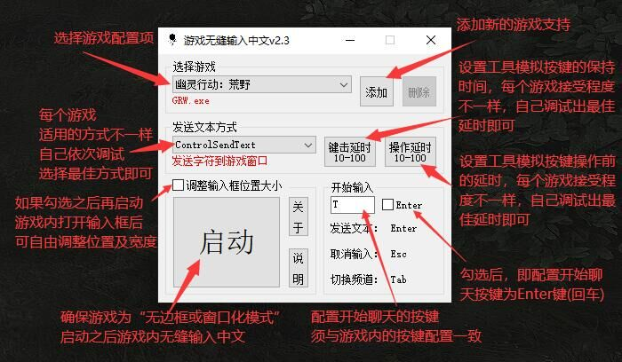

# GRW-CNChat
## 游戏无缝输入中文-通用性工具，采用AutoHotkey v2脚本语言编写。 
**游戏内无感对接，不用额外操作。正常按键开始聊天，回车发送，Esc取消，无缝输入中文。**  
[下载工具最新版本](https://github.com/GameXueRen/GRW-CNChat/releases/latest)
## 声明：  
* **此工具不涉及游戏文件及内存读写，仅模拟按键操作和使用win系统API实现全流程自动化。**
* **对于支持输入中文这种行为的后果，完全取决于游戏厂商的判定。此工具及作者不承担任何责任。**  
## 界面：

## 特色：
1. 启用后，无缝对接，游戏内无需额外操作，即可输入中文。
2. 支持自定义添加其他游戏适配。
3. 提供参数调试选项(5种发送方式、延时调校)，以适配更多游戏。
4. 自动保存各个游戏的工具配置及输入框调整后的位置大小
## 使用：  

## 游戏交流群：  

